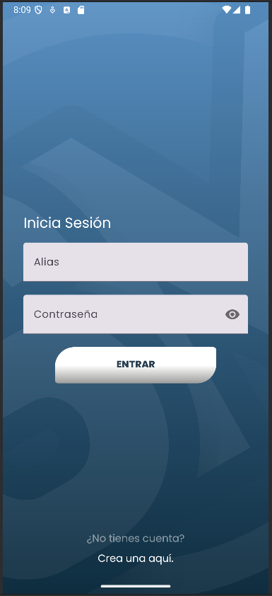
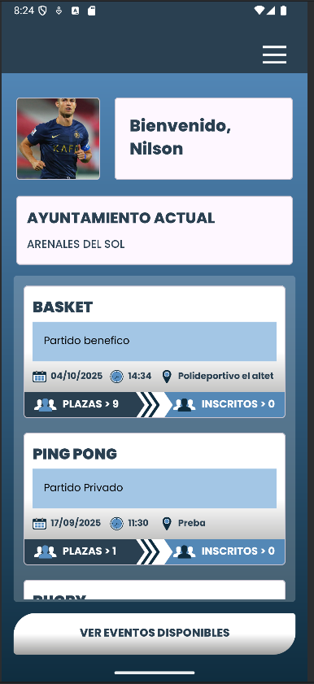
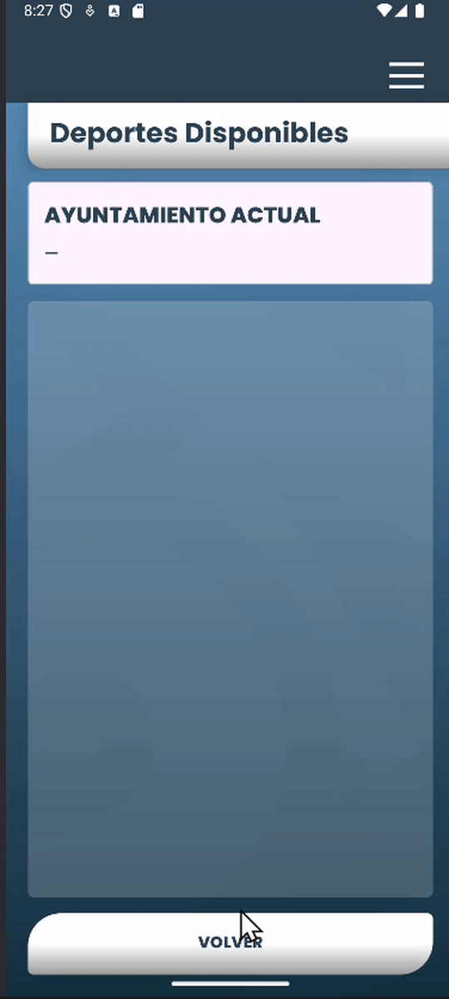

# SportMate · AppSportMate 🏀🏃‍♂️⚽

<p align="center">
  <a href="#english">🇬🇧 English</a> |
  <a href="#español">🇪🇸 Español</a>
</p>

---

## English


> **Technical TL;DR**  
> Android app built in Java using Clean Architecture + MVVM and Firebase.  
> Supports official and private events, real-time seat control,  
> role-based access, testing, and a strong social focus.

<details>
<summary><b>📑 Contents</b></summary>

- [🎯 Project Goal](#-project-goal)
- [📸 Screenshots](#-screenshots-main-flows)
- [🎥 Demo](#-demo-real-time-seat-management)
- [✅ Core Features](#-core-features)
- [📂 Project Structure](#-project-structure)
- [🧩 Architecture and Technical Decisions](#-architecture-and-technical-decisions)
- [🧪 Testing and Software Quality](#-testing-and-software-quality)
- [🌍 Flexible Event Management](#-flexible-event-management)
- [🤝 Social Impact of the Project](#-social-impact-of-the-project)
- [🛠️ Technologies Used](#tech-section)
- [🚀 Installation and Execution](#-installation-and-execution)
- [🔒 Security and Best Practices](#-security-and-best-practices)
- [📊 Project Status](#-project-status)
- [🔧 Future Improvements](#-future-improvements)
- [👥 Authorship](#-authorship)
- [📌 Key Learnings](#-key-learnings)
- [📄 License](#-license)

</details>


Android application developed as a **Final Degree Project (TFG) – DAM**, created to promote **sports participation**, **social inclusion**, and **connection between citizens and municipalities** through sports events with real-time seat management.

SportMate enables both **municipalities** and **users** to create and manage sports events within an **open, flexible, and social platform**, where anyone can practice sports, meet new people, and participate in activities without geographical, cultural, or social barriers.

The project addresses real-world issues such as **sedentary lifestyle**, **social isolation**, and **lack of community integration**, encouraging interaction between people of different ages, cultures, and backgrounds through sport as a shared element.

---

## 🎯 Project Goal

Develop a mobile application that allows:

- **Municipalities** to publish and manage official sports events with limited capacity.
- **Users** to **join existing events or create their own private events** anywhere.
- Enable sports participation even outside the user’s usual environment (travel, new cities, temporary stays).
- Build an **inclusive**, accessible, and socially driven sports community that promotes healthy habits and real human relationships.

All of this while maintaining a **robust architecture**, **data consistency**, and **secure role-based access control**.

---

## 📸 Screenshots (Main Flows)

<table align="center">
  <tr>
    <td align="center"><b>Login</b></td>
    <td align="center"><b>Event Details</b></td>
    <td align="center"><b>Profile / Home</b></td>
  </tr>
  <tr>
    <td></td>
    <td></td>
    <td></td>
  </tr>
</table>

<br/>

---


## 🎥 Demo (Real-Time Seat Management)

<p align="center">
  
</p>

<p align="center">
  <sub>
    Live demo showing automatic seat updates when a user joins or leaves an event, powered by Cloud Firestore.
  </sub>
</p>

---

## ✅ Core Features
#### 🔐 Authentication & Roles
- Secure sign-up and login using **alias + password**.
- Role-based system:
  - **User**
  - **Municipality**
- Authentication handled by **Firebase Authentication**.
- Persistent sessions and **role-based access control**.

#### 🏛️ Municipality Capabilities
- Create, edit, and delete **official sports events**.
- Define and manage **maximum participant capacity**.
- View the list of **registered participants** per event.
- Remove participants and automatically **free seats**.
- Automatic **real-time seat synchronization**.
- Centralized sports event management for the local community.

#### 👤 User Capabilities
- Browse **official municipality events**.
- **Create private sports events** in any location.
- Join or leave both **official and private events**.
- View events the user is registered in.
- Participate in sports activities even while **traveling or outside their city**.
- Automatic registration blocking when **no seats are available**.
- Full freedom to organize or participate in sports activities.

#### 🔄 Business Logic & Data Integrity
- **Real-time synchronization** using Cloud Firestore.
- Automatic and consistent **seat availability management**.
- Visibility and permissions controlled by **UID and role**.
- Prevention of duplicates, inconsistent registrations, and invalid states.
- Guaranteed consistency between **events, users, and participants**.

---  

## 📂 Project Structure
```
com.nilson.appsportmate
├── common
│ ├── datos.firebase // Shared Firebase configuration and utilities
│ ├── modelos // Shared models
│ └── utils // Constants, validations, and helpers
│
├── data
│ ├── local // Local data sources (if applicable)
│ ├── remote // Firebase / Firestore access
│ └── repository // Repository implementations
│
├── domain
│ ├── models // Domain models
│ ├── repository // Repository interfaces
│ └── usecase // Use cases (business logic)
│
├── di // Dependency injection
│
├── features // Feature-based modules
│ ├── townhall // Municipality features
│ └── user.ui // User features
│
├── ui
│ ├── auth // Login and registration
│ ├── splash // Splash screen
│ └── shared // Reusable components
│
├── App // Application class
└── MainActivity // Main activity
```
---

## 🧩 Architecture and Technical Decisions

The application is designed following **Clean Architecture + MVVM** with the goal of **separating responsibilities**, **improving maintainability**, and **facilitating project scalability**.

The business logic is **decoupled from the presentation layer**, which allows:

- Changing the data source (**Firebase, local, or mock**) without affecting the UI.
- Testing **use cases** in isolation.
- Maintaining code that is more **clean, predictable, and easy to evolve**.

The **MVVM architecture** is implemented across the entire application, with a clear separation of responsibilities:

- **UI**: Activities / Fragments (presentation)
- **ViewModel**: state management and presentation logic
- **Data**: repositories, Firebase, and models

All **CRUD operations are implemented manually** (without FirebaseUI) to maintain full control over business logic and data flows.

The organization by **layers** (`data`, `domain`, `ui`) and by **features** reflects a professional approach similar to that used in **real production projects**, preparing the application for future expansion without deep restructuring.

---

## 🧪 Testing and Software Quality

The project includes **real software testing**, focused on ensuring the reliability of critical processes.

### 🔍 Implemented Test Types
- **White-box testing**:
  - Internal logic validation.
  - Flow, condition, and state control.
- **Black-box testing**:
  - Functional validation from the user’s perspective.

### 🎯 Covered Cases
- Successful and failed login.
- Registration with valid and invalid data.
- Required field validations.
- Error handling and user feedback.

These tests focus mainly on **Login** and **Sign Up** flows, ensuring security and stability.

---

## 🌍 Flexible Event Management

SportMate enables **open and decentralized** event management, combining institutional organization with users’ personal initiative.

### 🧩 Supported Event Types
- **Official events**, created and managed by municipalities.
- **Private events**, freely created by users.
- Ability to join existing events or create new ones without geographical restrictions.

### 📍 Real Use and Social Reach

- Users can create or join events even when **outside their usual municipality**.
- The application is useful both locally and during travel, trips, or temporary stays.
- It facilitates spontaneous sports practice and human connection anywhere.

This approach transforms **SportMate** into a **social, inclusive, and scalable** platform designed for everyday use, not limited to a fixed context.

---

## 🤝 Social Impact of the Project

SportMate is an application with **real social impact**, designed to go beyond simple sports event organization.

- Reduces **sedentary lifestyle** by facilitating regular physical activity.
- Combats **social isolation** by promoting interaction between people with shared interests.
- Encourages **social integration** among people of different ages, cultures, and backgrounds.
- Strengthens **community cohesion**, using sport as a universal language.

The open and participatory approach of the application contributes to creating healthier, more inclusive, and socially connected environments, both locally and in broader contexts.

---

<a name="tech-section"></a>
## 🛠️ Technologies Used


- Android Studio  
- Java  
- Firebase Authentication  
- Cloud Firestore  
- Firebase Storage  
- Material Design Components  
- Git & GitHub

---

## 🚀 Installation and Execution

1. Clone the repository:
   ```bash
   git clone https://github.com/NilsonDevCode/SportMate.git
   ```
2. Open the project with Android Studio.
3. Create a project in Firebase:
- Enable Authentication (Email/Password).
- Enable Cloud Firestore.
- (Optional) Firebase Storage.
4. Download the google-services.json file and place it in:
`app/google-services.json`
5. Sync Gradle and run the app on an emulator or physical device.

---  

## 🔒 Security and Best Practices
- Data access restricted by UID.
- Clear separation between users and municipalities.
- Complete form validations.
- Prevention of unauthorized actions.
- Code prepared for advanced Firestore security rules.

## 📊 Project Status
- ✔ Functional and complete
- ✔ Evaluated and approved with excellent grade
- ✔ Solid business logic
- ✔ Clear and maintainable architecture
- ✔ Software tests implemented (white-box and black-box)

## 🔧 Future Improvements
- Expanded instrumented testing
- UI/UX improvements
- Push notifications
- Performance optimization

## 👥 Authorship
Project initially developed as a team (4 members).
This version corresponds to an independent copy, personally maintained and evolved.

**Original team:** Antonio, Jordy, Elio, Nilson
**Maintenance and evolution (personal fork):** Nilson

## 📌 Key Learnings
- Development of a complete Android application using MVVM architecture.
- Real integration of Firebase Authentication, Cloud Firestore, and Storage.
- Implementation of role and permission management at the application level.
- State control, real-time data synchronization, and consistency.
- Design and implementation of complex business logic without FirebaseUI.
- Application of software testing (white-box and black-box) in critical flows.
- Professional use of Git and GitHub in a collaborative environment.
- Modular, maintainable, and scalable code organization.

## 📄 License
This project is distributed for educational and demonstrative purposes.
It may be used as a reference while respecting the original authorship.

   


## Español


> **TL;DR técnico**  
> App Android en Java con Clean Architecture + MVVM y Firebase,  
> eventos oficiales y privados, control de plazas en tiempo real,  
> roles, testing y enfoque social.

<details>
<summary><b>📑 Contenido</b></summary>

- [🎯 Objetivo del proyecto](#-objetivo-del-proyecto)
- [📸 Capturas](#-capturas-flujos-principales)
- [🎥 Demo](#-demo-plazas-en-tiempo-real)
- [✅ Funcionalidades](#-funcionalidades-principales)
- [📂 Estructura del proyecto](#-estructura-del-proyecto)
- [🧩 Arquitectura](#-arquitectura-y-decisiones-técnicas)
- [🧪 Testing](#-testing-y-calidad-del-software)
- [🌍 Gestión de eventos](#-gestión-flexible-de-eventos)
- [🤝 Impacto social](#-impacto-social-del-proyecto)
- [🛠️ Tecnologías](#-tecnologías-utilizadas)
- [🚀 Instalación](#-instalación-y-ejecución)
- [📊 Estado del proyecto](#-estado-del-proyecto)
- [🔧 Futuras mejoras](#-futuras-mejoras)
- [👥 Autoría](#-autoría)
- [📌 Aprendizajes](#-aprendizajes-clave)

</details>


Aplicación Android desarrollada como **Proyecto Final de Ciclo (TFG) – DAM**, diseñada para fomentar la **participación deportiva**, la **inclusión social** y la **conexión entre personas y ayuntamientos** a través de eventos deportivos con control de plazas en tiempo real.

SportMate permite tanto a **ayuntamientos** como a **usuarios** crear y gestionar eventos deportivos, ofreciendo una plataforma **abierta, flexible y social**, donde cualquier persona puede practicar deporte, conocer gente y participar en actividades sin barreras geográficas, culturales o sociales.

El proyecto aborda problemas reales como el **sedentarismo**, el **aislamiento social** y la **falta de integración**, promoviendo la unión de personas de distintas edades, culturas y contextos mediante el deporte como elemento común.


## 🎯 Objetivo del proyecto

Desarrollar una aplicación móvil que permita:

- A los **ayuntamientos**, publicar y gestionar eventos deportivos oficiales con plazas limitadas.
- A los **usuarios**, **unirse a eventos existentes o crear sus propios eventos privados**, en cualquier lugar.
- Facilitar la práctica deportiva incluso fuera del entorno habitual del usuario (viajes, nuevas ciudades, estancias temporales).
- Crear una comunidad deportiva **inclusiva**, accesible y social, que fomente hábitos saludables y relaciones humanas reales.

Todo ello manteniendo una arquitectura sólida, datos coherentes y un control de acceso seguro basado en roles.

## 📸 Capturas (flujos principales)

<table align="center">
  <tr>
    <td align="center"><b>Login</b></td>
    <td align="center"><b>Detalle del evento</b></td>
    <td align="center"><b>Perfil / Inicio</b></td>
  </tr>
  <tr>
    <td></td>
    <td></td>
    <td></td>
  </tr>
</table>

<br/>

## 🎥 Demo (plazas en tiempo real)

<p align="center">
  
</p>
<p align="center">
  <sub>
    Demo real de la sincronización automática de plazas al inscribirse o darse de baja de un evento, usando Cloud Firestore.
  </sub>
</p>


## ✅ Funcionalidades principales

### 🔐 Autenticación y roles
- Registro e inicio de sesión mediante **alias + contraseña**.
- Gestión de roles:
  - **Usuario**
  - **Ayuntamiento**
- Autenticación segura con **Firebase Authentication**.
- Persistencia de sesión y control de acceso por rol.

### 🏛️ Funcionalidades de Ayuntamiento
- Crear, editar y eliminar **eventos deportivos oficiales**.
- Definir y gestionar el **número máximo de plazas** por evento.
- Visualizar el listado de **usuarios inscritos** en cada evento.
- Expulsar participantes y liberar plazas automáticamente.
- Control automático de plazas en **tiempo real** (suma/resta).
- Gestión centralizada de eventos deportivos para la comunidad local.

### 👤 Funcionalidades de Usuario
- Visualizar **eventos oficiales** creados por ayuntamientos.
- **Crear eventos deportivos privados** en cualquier ubicación.
- Unirse o darse de baja de eventos oficiales o privados.
- Visualizar los eventos en los que está inscrito.
- Buscar y participar en actividades deportivas incluso fuera de su entorno habitual (viajes, otras ciudades).
- Bloqueo automático de inscripción si no hay plazas disponibles.
- Libertad total para organizar o participar en actividades deportivas.


### 🔄 Lógica de negocio y control de datos
- Sincronización de datos en **tiempo real** mediante Cloud Firestore.
- Gestión automática y consistente de **plazas disponibles** en eventos.
- Control de acceso y visibilidad de la información según **UID y rol**.
- Prevención de duplicados, inscripciones inconsistentes y estados inválidos.
- Garantía de coherencia entre eventos, usuarios y participantes.

## 📂 Estructura del proyecto

```
com.nilson.appsportmate
├── common
│ ├── datos.firebase // Configuración y utilidades comunes de Firebase
│ ├── modelos // Modelos compartidos
│ └── utils // Constantes, validaciones y helpers
│
├── data
│ ├── local // Fuentes de datos locales (si aplica)
│ ├── remote // Acceso a Firebase / Firestore
│ └── repository // Implementaciones de repositorios
│
├── domain
│ ├── models // Modelos de dominio
│ ├── repository // Interfaces de repositorios
│ └── usecase // Casos de uso (lógica de negocio)
│
├── di // Inyección de dependencias
│
├── features // Módulos por funcionalidad
│ ├── townhall // Funcionalidades de ayuntamiento
│ └── user.ui // Funcionalidades de usuario
│
├── ui
│ ├── auth // Login y registro
│ ├── splash // Pantalla inicial
│ └── shared // Componentes reutilizables
│
├── App // Clase Application
└── MainActivity // Activity principal
```
## 🧩 Arquitectura y decisiones técnicas

La aplicación está diseñada siguiendo **Clean Architecture + MVVM** con el objetivo de **separar responsabilidades**, **mejorar la mantenibilidad** y **facilitar la escalabilidad** del proyecto.

La lógica de negocio se encuentra **desacoplada de la capa de presentación**, lo que permite:

- Cambiar la fuente de datos (**Firebase, local o mock**) sin afectar a la UI.
- Testear los **casos de uso** de forma aislada.
- Mantener un código más **limpio, predecible y fácil de evolucionar**.

La arquitectura **MVVM** está implementada en toda la aplicación, con una separación clara de responsabilidades:

- **UI**: Activities / Fragments (presentación)
- **ViewModel**: gestión de estado y lógica de presentación
- **Datos**: repositorios, Firebase y modelos

Los **CRUDs están implementados manualmente** (sin FirebaseUI) para tener control total sobre la lógica de negocio y los flujos de datos.

La organización por **capas** (`data`, `domain`, `ui`) y por **features** refleja un enfoque profesional, similar al utilizado en **proyectos reales de producción**, y prepara la aplicación para futuras ampliaciones sin necesidad de reestructuraciones profundas.

## 🧪 Testing y calidad del software

El proyecto incluye **pruebas de software reales**, centradas en garantizar la fiabilidad de los procesos críticos.

### 🔍 Tipos de pruebas implementadas
- **Pruebas de caja blanca**:
  - Validación de la lógica interna.
  - Control de flujos, condiciones y estados.
- **Pruebas de caja negra**:
  - Validación funcional desde la perspectiva del usuario.

### 🎯 Casos cubiertos
- Login correcto e incorrecto.
- Registro con datos válidos e inválidos.
- Validaciones de campos obligatorios.
- Gestión de errores y mensajes al usuario.

Estas pruebas se centran principalmente en los flujos de **Login** y **Sign Up**, garantizando seguridad y estabilidad.
## 🌍 Gestión flexible de eventos

SportMate permite una gestión de eventos **abierta y descentralizada**, combinando la organización institucional con la iniciativa personal de los usuarios.

### 🧩 Tipos de eventos soportados
- **Eventos oficiales**, creados y gestionados por ayuntamientos.
- **Eventos privados**, creados libremente por los propios usuarios.
- Posibilidad de participar en eventos existentes o crear nuevos sin restricciones geográficas.


### 📍 Uso real y alcance social

- Los usuarios pueden crear o unirse a eventos aunque se encuentren **fuera de su ayuntamiento habitual**.
- La aplicación es útil tanto en el entorno local como en desplazamientos, viajes o estancias temporales.
- Facilita la práctica deportiva espontánea y la conexión entre personas en cualquier punto del territorio.

Este enfoque convierte a **SportMate** en una plataforma **social, inclusiva y escalable**, pensada para el uso cotidiano y no limitada a un contexto fijo.

## 🤝 Impacto social del proyecto

SportMate es una aplicación con **impacto social real**, diseñada para ir más allá de la simple organización de eventos deportivos.

- Reduce el **sedentarismo**, facilitando la práctica deportiva regular.
- Combate el **aislamiento social**, promoviendo la interacción entre personas con intereses comunes.
- Fomenta la **integración social** entre personas de distintas edades, culturas y contextos.
- Refuerza la **cohesión comunitaria**, utilizando el deporte como lenguaje universal.

El enfoque abierto y participativo de la aplicación contribuye a crear entornos más saludables, inclusivos y socialmente conectados, tanto a nivel local como en contextos más amplios.


## 🛠️ Tecnologías utilizadas

- Android Studio  
- Java  
- Firebase Authentication  
- Cloud Firestore  
- Firebase Storage  
- Material Design Components  
- Git & GitHub  

## 🚀 Instalación y ejecución

1. Clona el repositorio:
   ```bash
   git clone https://github.com/NilsonDevCode/SportMate.git
   ```
   
2. Abre el proyecto con **Android Studio**.

3. Crea un proyecto en **Firebase**:
   - Activa **Authentication (Email/Password)**.
   - Activa **Cloud Firestore**.
   - (Opcional) **Firebase Storage**.

4. Descarga el archivo `google-services.json` y colócalo en:
`app/google-services.json`

5. Sincroniza Gradle y ejecuta la app en un emulador o dispositivo físico.

## 🔒 Seguridad y buenas prácticas
- Acceso a datos restringido por UID.
- Separación clara de usuarios y ayuntamientos.
- Validaciones de formulario completas.
- Prevención de acciones no autorizadas.
- Código preparado para reglas de seguridad avanzadas en Firestore.

## 📊 Estado del proyecto

✔ Funcional y completo

✔ Evaluado y aprobado con calificación excelente

✔ Lógica de negocio sólida

✔ Arquitectura clara y mantenible

✔ Pruebas de software implementadas (caja blanca y caja negra)

## 🔧 Futuras mejoras 
- Ampliación de test instrumentados
- Mejoras UI/UX
- Notificaciones push
- Optimización de rendimiento

## 👥 Autoría

Proyecto desarrollado inicialmente en equipo (4 personas).  
Esta versión corresponde a una copia independiente, mantenida y evolucionada de forma personal.

- **Equipo original:** Antonio, Jordy, Elio, Nilson  
- **Mantenimiento y evolución (fork personal):** Nilson  


## 📌 Aprendizajes clave

- Desarrollo de una aplicación Android completa con **arquitectura MVVM**.
- Integración real de **Firebase Authentication**, **Cloud Firestore** y **Storage**.
- Implementación de **gestión de roles y permisos** a nivel de aplicación.
- Control de estado, sincronización de datos y consistencia en tiempo real.
- Diseño e implementación de **lógica de negocio compleja** sin FirebaseUI.
- Aplicación de **pruebas de software** (caja blanca y caja negra) en flujos críticos.
- Uso profesional de **Git y GitHub** en un entorno colaborativo.
- Organización de código modular, mantenible y escalable.

## 📄 Licencia

Este proyecto se distribuye con fines educativos y demostrativos.  
Puede utilizarse como referencia respetando la autoría original.

